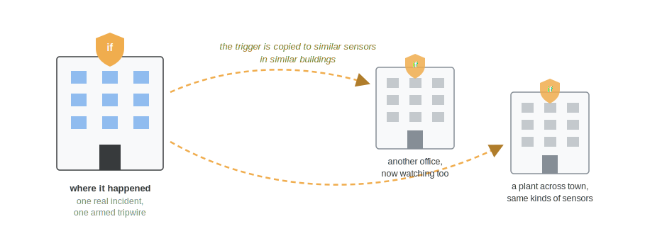

Picture an explosion in a parking garage. The people nearby do exactly what you would hope. Two of them drag a man clear of the smoke, one starts CPR, the rest run for safety. Nobody calls 911, because everyone who saw it has their hands full or is getting out. The call comes minutes later, from a woman who dialed once she felt safe. Those are long minutes in an emergency.

The garage had cameras. They recorded everything from the first frame, and they did nothing with it, because a camera has no way of knowing that what it just saw is worth summoning a fire brigade. The usual fix is to pre-program alarm systems to detect specific events, and that works only for the events someone thought to predefine. The ones nobody imagined in advance are exactly the ones that slip through.

This is the problem my patent goes after. It was granted this May as [US 12,634,398 B2](https://patents.google.com/patent/US20250112995A1/en) ([grant PDF](https://image-ppubs.uspto.gov/dirsearch-public/print/downloadPdf/12634398)), and the invention won Motorola's Top Invention of the Year award for 2021.

## Let the call teach the sensors

The idea is to use the 911 call, when it finally arrives, to teach the nearby sensors what mattered.

When the call comes in, the system finds the sensors that could have seen the incident and pulls what they recorded around that time and place, including the minutes before. Software then distills that recording into something small and checkable. The concrete version in our filing: image recognition reduces the incident video to a set of words, {explosion, fire, car, people, scream}.

From that summary the system arms what we called an alarm-escalating trigger. It has two parts. A condition, and it lives entirely in the metadata: new footage keeps getting tagged the same way, and the condition is that a new clip's tags share at least four of those five words. And a response staged in advance for that kind of incident: notify the responders' radios, alert the 911 call taker, open the emergency doors, sound the sirens.

{fig-alt="Six-panel storyboard. Panel one, a camera is already watching when the incident happens in its view. Panel two, it records everything and does nothing, having no way to know it matters. Panel three, minutes later someone safe calls 911 with the incident's time and place. Panel four, the call points back into the camera's recording and software tags what it saw with the words explosion, fire, car, people, scream. Panel five, the tags are tied back to the camera as an armed tripwire: if a new clip's tags share at least four of the five words, a staged response is ready, notify responders' radios, alert the call taker, open doors, sound sirens. Panel six, the camera keeps tagging what it sees, and when the tags match, the response starts on its own, no one has to call."}

Then the sensors watch, in tag space rather than pixel space. The camera never compares images to images; it compares small sets of words. If a later clip's tags meet the condition, the staged response fires. No one has to call.

{fig-alt="Two timelines. In the first incident, the incident happens, cameras see everything and do nothing, minutes pass while witnesses help or flee, then a 911 call comes from someone who reached safety, and only then does the response begin. In the next incident, with the tripwire armed, similar readings appear, the tripwire fires, and the response begins almost immediately, before any call or without one at all."}

That second timeline is the whole point. The first incident pays the cost of human judgement, one real 911 call, and converts it into a machine-checkable description of what an emergency looks like at this place. That is the payoff: the next time, a proper response can start before any notification from a witness, or without one at all.

## Why I find it elegant

A tripwire armed this way is narrow on purpose. It is tied to a place, to a kind of incident, and to sensor readings that accompanied a real emergency. The camera is never asked to decide what an emergency is in general, which is the version of the problem nobody knows how to solve. It is asked whether what it sees now resembles the thing a human already declared an emergency, and that is just a similarity check.

The wire also does not have to stay where it was laid. The trigger can be copied to similar sensors in similar buildings, an office tower, a plant with the same smart-building sensors, so a lesson learned once arms tripwires in many places. Our filing sketches the far end of this too: the accumulated incidents and their sensor readings become training data for a model that learns which readings deserve a response.

{fig-alt="A building where the incident happened carries an armed trigger shield. Dashed arrows copy the trigger to two other buildings with similar sensors, another office and a plant across town, each now carrying a smaller shield and watching for the same condition."}

This was joint work with my co-inventors Emmy Beltre, Kaveh Malakuti and Mariya Bondareva at Motorola Solutions. Filed September 2023, granted May 2026. The word set, the response actions and the garage-style scenario above are the examples from the patent itself.
