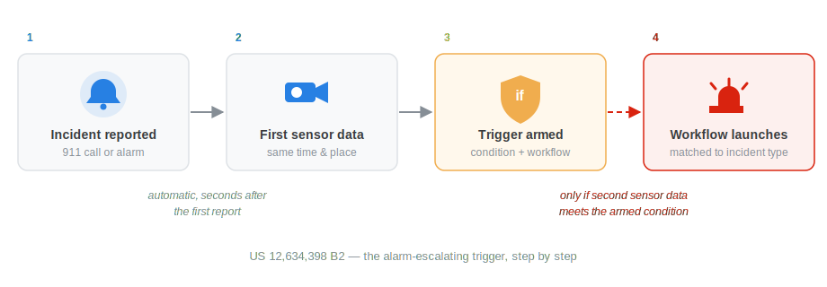
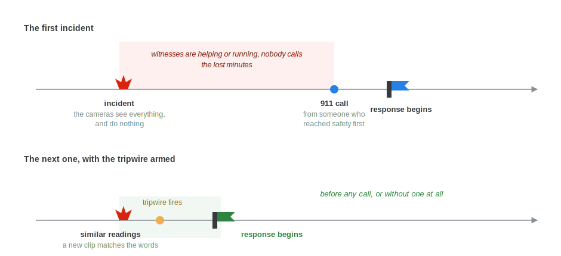

A smoke alarm goes off in an office building at 2 am. Most of the time it is nothing, burnt toast in a break room, a dusty detector, a glitch. Sending a fire crew out for every one of these wastes the crew and dulls the response for the night it is a real fire. Ignoring it and waiting for someone to call again is the opposite failure, help shows up late.

Emergency response systems have mostly had two gears, respond now or wait for a human to decide. The patent I worked on at Motorola Solutions adds a third gear: watch, and act only when the situation actually gets worse. It was granted this May as [US 12,634,398 B2](https://patents.google.com/patent/US20250112995A1/en) ([grant PDF](https://image-ppubs.uspto.gov/dirsearch-public/print/downloadPdf/12634398)), and the invention won Motorola's internal Patent of the Year award in 2022.

## How it works

When a report comes in, a 911 call or an alarm, the system pulls sensor data tied to that time and place, nearby cameras, microphones, IoT sensors. It does not use that data to start a response. It uses it to arm a trigger.

{fig-alt="Four-step flow diagram: incident reported, first sensor data retrieved from the same time and place, trigger armed with a condition and matched workflow, and workflow launches only if second sensor data meets the armed condition."}

The trigger has two parts. First, an alarm-escalating condition derived from that initial sensor data, which describes what getting worse would look like for this incident at this location. Second, a response workflow matched to that kind of escalation, selected ahead of time and kept ready.

Then the system waits. If later sensor data meets the armed condition, say smoke reaching a second detector or the audio signature intensifying, the workflow starts on its own, carrying the context responders need.

{fig-alt="Timeline chart showing a sensor reading over time. At the incident report, the trigger is armed and a dashed threshold line labeled alarm-escalating condition appears. The reading later crosses the threshold, marked as condition met, launching the response workflow."}

The way I describe it to friends is a tripwire. The initial report decides where the wire is laid and what should happen when it is crossed. If nothing ever crosses it, nobody is bothered.

## Why I like this design

Attaching camera footage to a 911 call gives a dispatcher more to look at, but the judgement of whether an incident is escalating still rests on a human watching feeds. The minutes after a first report are exactly when a minor incident either fizzles out or turns into the real thing, and this design moves that judgement into the system for that window, with the response already staged for the form the escalation would take.

This was joint work with my co-inventors Emmy Beltre, Kaveh Malakuti and Mariya Bondareva. Filed September 2023, published April 2025, granted May 2026.
