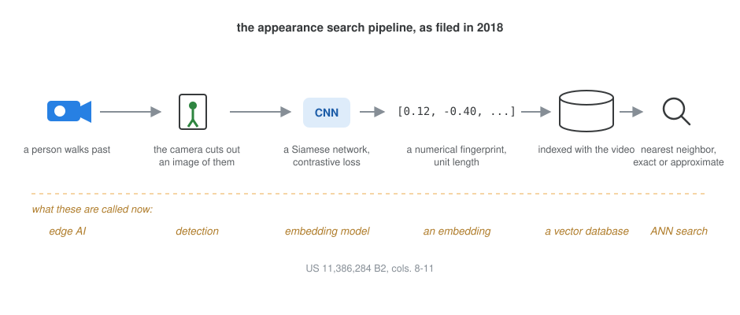
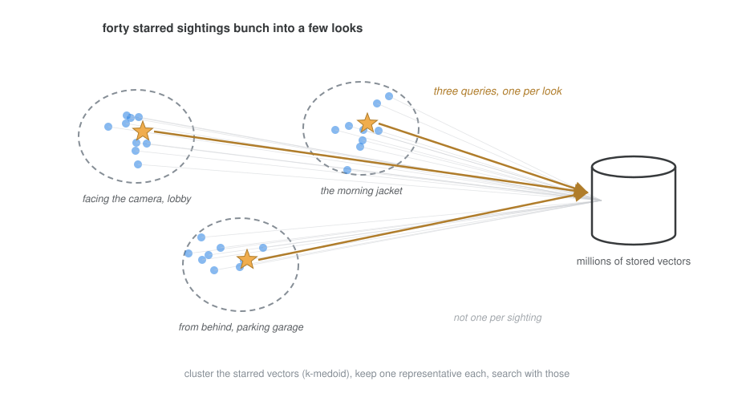

::: {.patent-why}
**Search a video archive by resemblance.** Give it one photo of a person and it finds everyone in the footage who looks like them, fast enough to use while you wait. That was 2018, built on the idea underneath today's vector databases, before they had the name.
:::

An operator is looking for someone. One reference image, a still from a lobby camera, goes into appearance search, and the system returns sightings that look similar: the same person by the elevators, someone in a similar jacket at the loading dock, a false hit or two. The operator stars the true ones and searches again, and the results get better, because the query now knows the person from four angles instead of one. Star by star, the search sharpens.

It also gets heavier. Every starred image is a feature vector, and every vector is another query against a database holding millions of them. By the time the operator has starred forty sightings across a dozen cameras, the refine button is asking for forty searches and a merge. Somewhere around there the feature stops feeling instant, and an operator who has to wait stops refining.

My patent with Nicholas Alcock and Peter Venetianer, [US 11,386,284 B2](https://patents.google.com/patent/US11386284B2/en) ([grant PDF](https://image-ppubs.uspto.gov/dirsearch-public/print/downloadPdf/11386284)), is about keeping that loop fast: cluster the starred vectors, keep one representative per cluster, and search with those.

## The stack, before the names

It is worth pausing on what the filing takes for granted, because in 2018 none of it had the names it has now. The cameras carried a neural chip that cut out images of people as they moved through a scene. A convolutional network, a Siamese architecture trained with a contrastive loss, turned each image into a feature vector, a numerical fingerprint of appearance, normalized to unit length. The vectors were indexed and stored in a database alongside the video. Searching meant taking a query vector and evaluating its distance to every stored vector in the time range, exact nearest neighbor, and the filing describes the approximate variant too, hashing-based, faster, able to miss true matches. An embedding model, a vector database, the exact-versus-approximate tradeoff: the whole kit, running inside security cameras, years before any of it was a product category.

{fig-alt="A pipeline diagram: a person walks past a camera, the camera cuts out an image of them, a Siamese CNN with contrastive loss produces a numerical fingerprint of unit length, it is indexed in a database with the video, and search is nearest neighbor, exact or approximate. A dashed row underneath gives the names these acquired later: edge AI, detection, embedding model, an embedding, a vector database, ANN search."}

## One representative per look

The invention sits on the query side. Forty starred sightings of one person are not forty independent pieces of information. They bunch: a cluster of him facing the camera in the lobby, a cluster from behind in the parking garage, a cluster in the jacket he wore only that morning. Sightings within a bunch return nearly the same matches, so searching with all of them buys redundancy at full price.

So when the starred set outgrows the compute budget, the filing clusters its vectors, k-medoid in the main embodiment, and searches with one representative per cluster. The representative can be chosen for what it shows, a clear face, a full body, or a recent sighting over a stale one, or it can simply be the cluster's medoid. Medoids over means for a plain reason: a medoid is an actual image someone starred, not an arithmetic ghost, and the average of unit-length vectors does not even stay unit length. Forty queries become three or four, and the refine loop feels instant again.

{fig-alt="A scatter of starred sightings as dots, bunched into three dashed clusters labeled facing the camera in the lobby, from behind in the parking garage, and the morning jacket. One dot in each cluster is marked with a star, and only the three starred medoids send arrows to a database cylinder holding millions of stored vectors, labeled three queries, one per look. Faint gray lines from every dot to the database are labeled not one per sighting."}

## What aged well, and what did not

Reading it back in 2026, the part that aged best is the shape of the problem: queries made of many vectors, and the need to prune them without losing what they know. That problem came back with force, multi-vector retrieval, multi-query RAG, prototype selection, every system that condenses a set of embeddings before paying for search. The part that aged least is the arithmetic that motivated us: modern indexes answer a single query over millions of vectors in about a millisecond, so the forty-search budget that hurt in 2018 barely registers now. The pruning survives anyway, because collections grew faster than indexes got clever, and because redundant queries cost money even when they are fast.

The system around this is Avigilon's Appearance Search, and the star-and-refine loop in the filing's figures is that product's own workflow. Filed September 2018 as a provisional, granted July 2022. Twenty-five patent families cite it so far.

::: {.callout-note appearance="simple"}
These posts are my attempt to explain my own patents in plain English, with the diagrams I wish the filings had. In the order I wrote them: [The Tripwire Patent](../2026-07-07-the-tripwire-patent/index.qmd) · [Learning Normal](../2026-07-09-learning-normal/index.qmd) · **Vector Search, 2018** · [The Poses of Normal](../2026-07-21-poses-of-normal/index.qmd) · [Video, in Bits](../2026-07-30-video-in-bits/index.qmd).
:::
