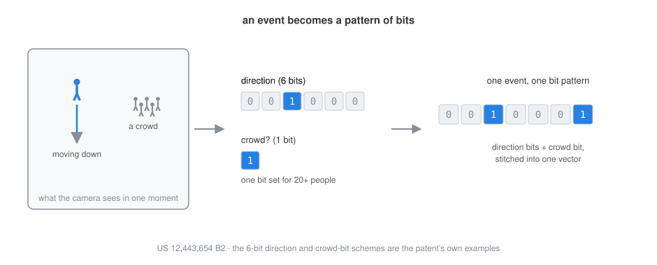

::: {.patent-why}
**Search security video by example.** Point at one moment, a person going the wrong way down a corridor, and it finds every other moment like it across weeks of footage. Each event becomes a pattern of bits, arranged so that similar events share bits, which turns the search into little more than counting.
:::

Somewhere there is a week of video and a person who has to find one thing in it: the moment that matches one they already have. A figure moving against the flow, a crowd forming where a crowd should not, a car going the wrong way. They know it when they see it. The trouble is the seeing, because finding it means scrubbing, hours of ordinary footage for the few seconds that are not.

You can put a rules engine in front of the video, but rules have to be written, and writing the rule for "something like this" is exactly the thing nobody quite knows how to do in advance. My patent with Yanyan Hu, [US 12,443,654 B2](https://patents.google.com/patent/US12443654B2/en) ([grant PDF](https://image-ppubs.uspto.gov/dirsearch-public/print/downloadPdf/12443654)), takes a different route: it turns every event in the video into a short pattern of bits, and makes searching a matter of comparing those patterns.

## An event as a handful of bits

The camera's analytics already describe what happens in a scene as metadata: a person walking, a vehicle turning, a crowd gathering. The idea is to reduce each of those events to a bit pattern. Movement gets a few bits, one for each direction it might go. Occupancy gets a bit that flips on when the crowd passes some size. Stitch the pieces together and a moment of video becomes a short binary vector, a row of ones and zeros that says, in the plainest possible terms, what was going on.

{fig-alt="A scene showing a person moving downward and a small crowd. The movement maps to a six-bit direction vector with the down bit set, and the crowd maps to a single occupancy bit set for twenty or more people. The two are concatenated into one seven-bit binary vector labeled one event, one bit pattern."}

The whole video becomes a set of these vectors, one per interval, kept in an index. The interval length is about the only real knob: ten seconds keeps the index compact, one second keeps it precise.

## Similar things share bits

The encoding itself is worth pausing on. If you encode direction as one bit per direction, then "down" and "down and slightly left" share no bits at all, even though they are nearly the same thing. So the encoding is made to overlap instead: a direction is written as a small band of neighbouring bits, and a nearby direction's band overlaps it. Two events that are alike now carry ones in the same places.

```{=html}
<figure>
<video autoplay muted loop playsinline controls style="width:100%; border-radius:8px;" aria-label="Animation. A query bit pattern for movement that is down-ish appears. A similar clip's pattern appears below it, and the bits the two share light up in amber, counted as two shared bits and labeled close. A third clip moving up appears and shares no bits with the query, labeled far. A closing line notes that counting shared bits is a dot product, or cheaper still.">
  <source src="shared-bits.mp4" type="video/mp4">
</video>
<figcaption>Similarity is just the bits two patterns share; nearby events overlap, opposite ones do not.</figcaption>
</figure>
```

Once similarity is shared bits, comparing two events is just counting the bits they have in common, a dot product, or a cheaper bitwise operation still. There is no learned embedding and no model to train. The meaning is designed into where the bits fall, so that closeness in the world becomes closeness in the pattern. The same overlapping trick handles anything that wraps around: a compass direction, or the time of day, where eleven at night and one in the morning ought to sit near each other, and now do.

## Where it happened

Location works the same way, through a stack of grids at different scales, from a single cell covering the whole scene down to a fine sixteen-by-sixteen. An event lights a cell at each scale, so you can ask for "movement anywhere" or "movement in that far corner" just by choosing how fine a grid to read.

```{=html}
<figure>
<video autoplay muted loop playsinline controls style="width:100%; border-radius:8px;" aria-label="Animation. A rectangular scene holds a single figure in the lower-right. The scene is first one cell, the whole frame, then divides into a two-by-two grid, then four-by-four, then sixteen-by-sixteen. At each step the cell containing the figure is highlighted in green and shrinks around it, from the whole scene down to a single small cell. A closing line notes that a coarse grid asks anywhere, and a fine grid asks right there.">
  <source src="multiscale-grid.mp4" type="video/mp4">
</video>
<figcaption>The same event, located at every scale. Choose how fine a grid to read, and you choose how precisely to pin the spot.</figcaption>
</figure>
```

## And when

Time gets the same treatment, and it is where the overlap trick earns its keep, because time is full of moments that ought to feel close but look far apart on a clock. Late Sunday and early Monday belong together; so do the minute before midnight and the minute after. The filing writes a timestamp two ways. The plain way is one-hot, seven bits for the day of the week, twenty-four for the hour, where Tuesday is Tuesday and sits near nothing. That suits an exact match and nothing around it.

The other way carries similarity. A moment in the week becomes a band of contiguous bits spread across neighbouring hours, so a late Tuesday evening and an early Wednesday morning share bits and score as close, while Tuesday and Monday, further off, share fewer. The band wraps at the ends, so Sunday night falls beside Monday morning and the last minute of a day beside the first. The same scheme at the scale of a single day puts an event at 9:55 in the evening nearer to one at 10:25 than to one at 9:05. Ask for "around this time" and you get the neighbourhood, not just the exact tick.

```{=html}
<figure>
<video autoplay muted loop playsinline controls style="width:100%; border-radius:8px;" aria-label="Animation. A day drawn as a ring of twenty-four hour cells, with a lit band near midnight at the top, unrolls into a horizontal row of bits; because the band sat on the seam, it lands split across both ends of the row, and a dashed connector marks that the two ends are the same seam. The same is then shown for a week of seven days and a month of thirty days, each a circle unrolling into a row. A closing line notes it is the same trick at any period, and that near times share bits.">
  <source src="time-unroll.mp4" type="video/mp4">
</video>
<figcaption>A moment in a cycle becomes a band of bits; unroll the circle and its two ends turn out to be neighbours. Shown for a day, a week, and a month.</figcaption>
</figure>
```

## One long row

So far each piece is its own small pattern of bits: a direction, a crowd, a place, a time. The last step just lays them end to end. The time bits come first, then the bits for each cell of the grid, in a fixed order, and the whole lot is one long row. Because that order never changes, the bit in a given position always means the same thing, in every moment, across the whole index. That is what makes two moments comparable at all: line the rows up and count.

```{=html}
<figure>
<video autoplay muted loop playsinline controls style="width:100%; border-radius:8px;" aria-label="Animation. A scene is divided into a two-by-two grid, with a person moving down in the top-right cell and a small crowd in the bottom-left cell. Each cell becomes a small group of bits, and a time segment plus the four cell segments slide together and line up into one long row, labeled time, cell 1, cell 2, cell 3, cell 4. A brace under the row reads one moment of video equals one row of bits, and a note adds that each piece keeps its place so a given bit always means the same thing.">
  <source src="stack-vector.mp4" type="video/mp4">
</video>
<figcaption>Every piece — time, and each cell of the grid — stacks into one long vector, each in its fixed place.</figcaption>
</figure>
```

## Search by example

Now the search that investigator wanted is easy to state. Take the moment you already have, read off its bit pattern, and compare it against every pattern in the index. Rank by how many bits they share. What comes back is a list of moments, most alike first, each with a score and a timestamp to jump to.

```{=html}
<figure>
<video autoplay muted loop playsinline controls style="width:100%; border-radius:8px;" aria-label="Animation. A query frame of a person moving down becomes a bit pattern. An arrow labeled compare points to an event index drawn as a database cylinder holding every moment in bits. Three result frames come back ranked by similarity, the two most alike scored 0.95 and 0.89 in green, and the least alike scored 0.51. A closing line notes the results are ranked by shared bits, with scores from the filing's Fig. 9.">
  <source src="search.mp4" type="video/mp4">
</video>
<figcaption>The query is an example, and the results come back ranked by shared bits.</figcaption>
</figure>
```

Nobody had to write a rule for "a person going the wrong way." The example is the query.

## Or just one corner of it

Because the row is built in pieces, a query can be built the same way. You do not have to fill in every bit. Set only the bits you care about, a person moving down, in only the part of the scene that matters, the cell over the loading door, and leave the rest open. The comparison then counts matches only where you asked. "Someone going the wrong way through that door" becomes a query you compose rather than a rule you write, and the grid is what makes a place selectable at all: pick a cell, and the search is masked down to it.

```{=html}
<figure>
<video autoplay muted loop playsinline controls style="width:100%; border-radius:8px;" aria-label="Animation. A scene is divided into a three-by-three grid, and the top-right cell is highlighted in amber and labeled only here, with a person moving down inside it. Below, a query vector of nine two-bit segments appears, one segment per cell. Only the segment for the highlighted cell is filled in blue; the rest are greyed out as wildcards. That active segment is boxed and labeled the only bits that matter, with an arrow tying it back to the highlighted cell. A note reads compose a query by stacking: fill the bits you care about, leave the rest open.">
  <source src="mask-query.mp4" type="video/mp4">
</video>
<figcaption>Fill in the bits for one region and leave the rest open, and the search is masked down to that corner of the scene.</figcaption>
</figure>
```

## Why bits

Feature vectors of floating-point numbers can do similarity search too, and an [earlier patent of mine](../2026-07-14-vector-search-2018/index.qmd) did exactly that for appearance search. Bits buy something different. They are tiny to store and trivial to compare, a few machine instructions per event, which matters when the index holds every second of every camera for months. And because the similarity is built into the encoding rather than learned, you can read a pattern off and know what it means. It is the low-tech cousin of a vector database, and for a great many surveillance questions it is enough.

This was joint work with Yanyan Hu at Motorola Solutions. Filed January 2023, granted October 2025.

::: {.callout-note appearance="simple"}
These posts are my attempt to explain my own patents in plain English, with the diagrams I wish the filings had. In the order I wrote them: [The Tripwire Patent](../2026-07-07-the-tripwire-patent/index.qmd) · [Learning Normal](../2026-07-09-learning-normal/index.qmd) · [Vector Search, 2018](../2026-07-14-vector-search-2018/index.qmd) · [The Poses of Normal](../2026-07-21-poses-of-normal/index.qmd) · **Video, in Bits**.
:::
